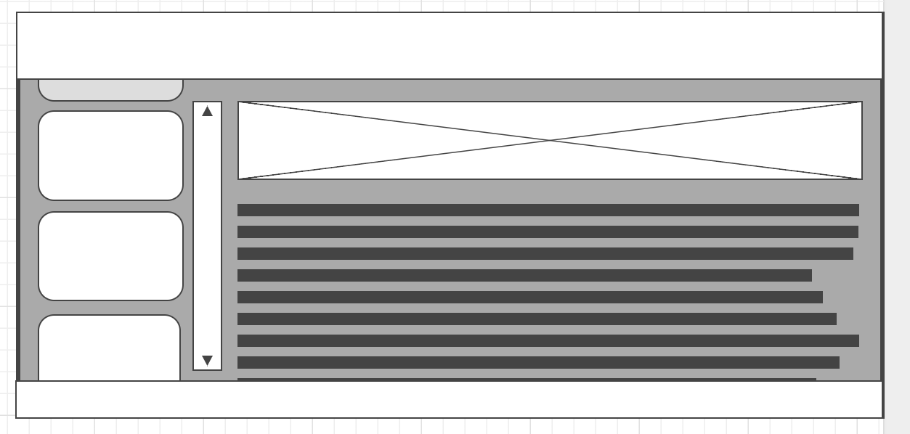

# Nordic Choice Hotels Payroll Informational Website
##### First Milestone Project, Code Institute, User Centric Frontend Development 

This site provides information on various payroll related topics for the employees 
of Nordic Choice Hotels. The site is meant to answer frequently asked questions. 
You may find the site [here](https://danfiliphoff.github.io/Milestone-Project-Final/).

## UX
I aimed to create an easily navigated site in a blue colour scheme, which is typical for
the company. 

My hope is that employees will be able to find condensed easily understood 
answers to the questions most commonly asked to the payroll departemnt. 
Say that an employee wants to understand how the deduction for income tax
is determined. Prevously they had to contact their manager whom emailed the payroll office.
The manager then had to wait up to a week for a reply. After that the manager had to explain or forward the response to the employee.

I aimed to create an easily navigated site in a blue colour scheme, which is typical for the company. 

My hope is that employees will be able to find condensed easily understood answers 
to the questions most commonly asked to the payroll department. Say that an employee 
wants to understand how the deduction for income tax is determined. Previously they 
had to contact their manager whom emailed the payroll office. The manager then had 
to wait up to a week for a reply. After that, the manager had to explain or forward
the response to the employee. 

This website is meant to make this chain of information shorter and create 
efficiency’s for employees, managers and the payroll department. Using this webpage
the employee can look up a question immediately without the involvement of a manager. 
This will also lighten the workload of the payroll department. 

To get a basic concept of what the page might look like I made a simple wireframe 
using the free [wireframe.cc](https://wireframe.cc/) tool.

There is a contact page but it has purposely been semi-hidden. The only way to
get to it is by clicking the email symbol in the footer. The idea is that the 
employee should look through the site and only make contact after having tried to 
find the answer to the question on the site.  

## Features
The site uses a bootstrap navigation bar that collapses when viewed on smaller
screens. Throughout the site, there is various links to external resources. 

#### Features left to implement. 
- There is a search window that does not perform searches. In the future, I
would like to get this function up and running. 
- The contact page does not send emails. 
- The page does not currently contain a complete list of the topics that an 
employee might seek information about. I have built the site with the consideration 
that more topics should be added in the future. 
- I would like to add various input elements that would help the employee make salary 
related calculations. For example, on the taxation page there is currently a link to 
a page that helps the employee find his taxation table. I would like this function
to be available directly on the taxation page. 

## Technologies Used
- [HTML/CSS](https://www.w3.org/html/) to write the code.
- [Bootstrap](https://getbootstrap.com/docs/3.3/) to simplify the design process.

## Testing.
All text have been proof read, fact checked to ensure that the user will be easily
understood, and accurate information on the topics covered. Links have been manually
tested to ensure they open in a new separate window and that the destination is the
intended. All pages have been tested for compatibility with the standard screen 
sizes in google developer’s tools. All code have been validated using the W3C validator. 

## Deployment.
GitHub pages have been used to deploy the site. The master branch is beeing used.

## Credits

#### Content
- Much of the written content have been fact checked against the book [rätt lön](https://www.adlibris.com/se/bok/ratt-lon-2019-9789152355480?gclid=EAIaIQobChMImO7fkLbS4QIVAkkYCh0lfwzvEAYYASABEgKbqvD_BwE/) by Erika Dahlgren.
- Information on the pension topic have been taken from  [Collectum](https://www.collectum.se/en/Private-persons/).
- The taxation topic is based on information from the [Swedich tax agency](https://www.skatteverket.se/).
- For the sick leave page information from the Swedish social insurance agency, [försäkringskassan](https://www.forsakringskassan.se/) was used.

#### Media
- The Choice logo used in the footer was obtained from Nordic Choice’s image archives. 
- The image in the pension section is a cut-out from [Collectum](https://www.collectum.se/en/Private-persons/).
- The example of a benefit on a payslip is taken from a Hogia + generated payslip. 
- The cut out from the taxation table is taken from [Taxation tabel 34](https://www.skatteverket.se/download/18.309a41aa1672ad0c83758bb/tabell-34-manad-2019.pdf). 
- The background image used for the topics is taken from [topasimages](https://www.topsimages.com/images/modern-abstract-powerpoint-templates-bubble-82.html).
- The introduction video to Kivra is taken from Kivras offical [youtube channel](https://www.youtube.com/user/KivraAB)

#### Acknowledgements 
A special thanks to my dear colleagues who inspired the idea to the website. 
The help from Code institutes mentors have been essential to problem solving throughout 
the project. 

